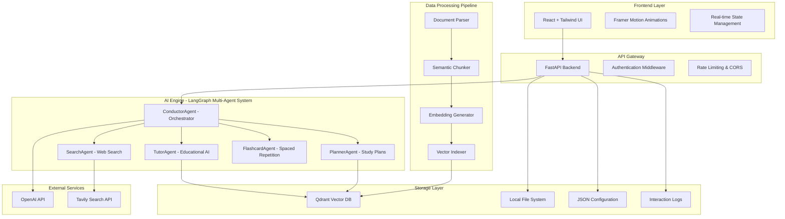
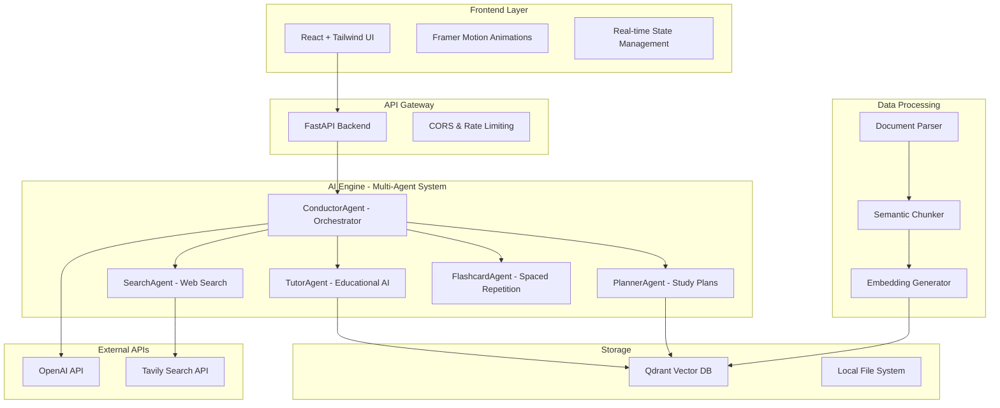

# StudyBuddy AI

**Name: Rahul Raj**

**Institute : Indian Institute of Technology Bhilai**

**Department : Computer Science and Engineering**


**An Intelligent Study Companion Powered by Multi-Agent AI**

StudyBuddy AI transforms static documents into interactive, adaptive learning experiences using advanced AI technologies. Upload your PDFs and Excel files to get personalized tutoring, automated study plans, AI-powered flashcards, and intelligent document analysis.

[](https://opensource.org/licenses/MIT)
[](https://www.python.org/downloads/)
[](https://reactjs.org/)
[](https://fastapi.tiangolo.com/)

## ✨ Features

### 🤖 Multi-Agent AI System

- **ConductorAgent**: Intelligent workflow orchestration and intent analysis
- **TutorAgent**: Personalized educational responses with source attribution
- **PlannerAgent**: Structured study plan generation with timelines
- **SearchAgent**: Web search integration for enhanced learning resources
- **FlashcardAgent**: Spaced repetition system with adaptive difficulty

### 📚 Document Intelligence

- **Smart Upload**: Support for PDF, Excel, and DOCX files
- **Semantic Search**: Vector-based similarity search across documents
- **Context-Aware Chat**: Ask questions and get answers with page references
- **Automatic Processing**: Intelligent chunking and embedding generation

### 🎯 Learning Tools

- **AI Study Plans**: Comprehensive, personalized learning paths
- **Smart Flashcards**: Auto-generated cards with spaced repetition
- **Progress Dashboard**: Visual analytics and learning statistics
- **Interactive Chat**: Real-time AI tutoring with workflow visualization

### 🎨 Modern Interface

- **Responsive Design**: Works seamlessly on desktop and mobile
- **Dark/Light Mode**: Adaptive theming for comfortable studying
- **Smooth Animations**: Framer Motion powered interactions
- **Real-time Updates**: Live feedback and progress tracking

---

## 🚀 Quick Start

### Prerequisites

- **Docker & Docker Compose** (recommended)
- **Python 3.10+** (for development)
- **Node.js 16+** (for frontend development)
- **OpenAI API Key** ([Get one here](https://platform.openai.com/api-keys))

### Option 1: Docker Compose (Recommended)

1. **Clone the repository**

   ```bash
   git clone (https://github.com/Rahul5977/StudyBot)
   cd StudyBuddy
   ```

2. **Set up environment variables**

   ```bash
   cp .env.example .env
   # Edit .env and add your OpenAI API key
   ```

3. **Start all services**

   ```bash
   docker-compose up --build
   ```

4. **Access the application**
   - Frontend: [http://localhost:3000](http://localhost:3000)
   - Backend API: [http://localhost:8000](http://localhost:8000)
   - API Documentation: [http://localhost:8000/docs](http://localhost:8000/docs)
   - Qdrant Vector DB: [http://localhost:6333](http://localhost:6333)

### Option 2: Development Setup

1. **Backend Setup**

   ```bash
   cd backend
   python -m venv venv
   source venv/bin/activate  # On Windows: venv\Scripts\activate
   pip install -r requirements.txt

   # Start Qdrant with Docker
   docker run -p 6333:6333 qdrant/qdrant:latest

   # Start backend server
   uvicorn app.main:app --reload --port 8000
   ```

2. **Frontend Setup**
   ```bash
   cd frontend
   npm install
   npm start
   ```

---

## 🏗️ System Architecture



### High-Level Architecture



### Technology Stack

| Component               | Technology                            | Purpose                                       |
| ----------------------- | ------------------------------------- | --------------------------------------------- |
| **Frontend**            | React 18, Tailwind CSS, Framer Motion | Modern, responsive UI with smooth animations  |
| **Backend**             | FastAPI, Python 3.10+                 | High-performance async API server             |
| **AI Framework**        | LangChain, LangGraph, OpenAI          | Multi-agent orchestration and LLM integration |
| **Vector DB**           | Qdrant                                | Fast similarity search and document retrieval |
| **Document Processing** | PyPDF2, pandas, openpyxl              | Extract and process various file formats      |
| **Containerization**    | Docker, Docker Compose                | Consistent development and deployment         |

---

## 📁 Project Structure

```
StudyBuddy/
├── 📂 backend/                 # FastAPI backend application
│   ├── 📂 app/
│   │   ├── 📂 agents/         # Multi-agent AI system
│   │   │   ├── conductor.py   # Main orchestrator agent
│   │   │   ├── planner.py     # Study plan generation
│   │   │   └── search_agent.py # Web search integration
│   │   ├── 📂 api/            # API route handlers
│   │   │   ├── routes_chat.py
│   │   │   ├── routes_docs.py
│   │   │   ├── routes_plan.py
│   │   │   └── routes_flashcards.py
│   │   ├── 📂 core/           # Core services and utilities
│   │   │   ├── config.py      # Configuration management
│   │   │   ├── db.py          # Database connections
│   │   │   └── logger.py      # Logging setup
│   │   └── 📂 services/       # Business logic services
│   │       ├── simple_rag.py  # RAG pipeline
│   │       └── embeddings.py  # Vector embeddings
│   ├── requirements.txt
│   └── Dockerfile
├── 📂 frontend/               # React frontend application
│   ├── 📂 src/
│   │   ├── 📂 components/     # React components
│   │   │   ├── Dashboard.jsx  # Analytics dashboard
│   │   │   ├── ChatBox.jsx    # AI chat interface
│   │   │   ├── Flashcards.jsx # Spaced repetition system
│   │   │   └── UploadForm.jsx # File upload handling
│   │   ├── 📂 pages/          # Page components
│   │   │   └── Home.jsx       # Main application layout
│   │   └── 📂 utils/          # Utility functions
│   │       └── api.js         # API communication
│   ├── package.json
│   └── tailwind.config.js
├── 📂 data/                   # Processed documents and metadata
├── 📂 storage/                # Uploaded files storage
├── 📂 logs/                   # Application logs
├── docker-compose.yml         # Multi-service orchestration
├── .env.example              # Environment variables template
└── README.md                 # Project documentation
```

---

## 🔧 Configuration

### Environment Variables

Create a `.env` file in the project root:

```env
# OpenAI Configuration
OPENAI_API_KEY=sk-your-openai-api-key-here

# Tavily Search API (optional)
TAVILY_API_KEY=your-tavily-api-key

# Qdrant Configuration
QDRANT_HOST=localhost
QDRANT_PORT=6333
QDRANT_COLLECTION=studybuddy_docs

# Application Settings
DEBUG=true
MAX_FILE_SIZE=52428800  # 50MB
CHUNK_SIZE=1000
CHUNK_OVERLAP=200

# CORS Settings
ALLOWED_ORIGINS=http://localhost:3000,http://localhost:3002
```

### Frontend Configuration

Update `frontend/src/utils/api.js` if needed:

```javascript
const API_BASE_URL = process.env.REACT_APP_API_URL || "http://localhost:8000";
```

---

## 💻 Usage Guide

### 1. Upload Documents

1. Navigate to the **Upload Documents** tab
2. Drag and drop or select PDF/Excel files
3. Wait for processing to complete
4. View processed documents in the file list

### 2. AI Chat

1. Go to the **AI Chat** tab
2. Ask questions about your uploaded documents
3. View real-time agent workflow steps
4. Get responses with source page references

**Example queries:**

- "Explain the main concepts in this document"
- "Create a summary of chapter 3"
- "What are the key formulas mentioned?"

### 3. Study Plans

1. Switch to the **Study Plans** tab
2. Enter a topic (e.g., "Machine Learning Fundamentals")
3. Click "Generate Plan" to create a structured learning path
4. Edit and customize the generated plan

### 4. Flashcards

1. Visit the **Flashcards** tab
2. Generate flashcards from your documents
3. Review cards with spaced repetition algorithm
4. Rate difficulty to improve future scheduling

### 5. Dashboard

Monitor your learning progress:

- Study plan completion rates
- Flashcard review statistics
- Recent activity timeline
- Document processing status

---

## 🔌 API Reference

### Core Endpoints

#### Document Management

```http
POST   /api/documents/upload     # Upload and process documents
GET    /api/documents            # List all documents
GET    /api/documents/{id}       # Get document details
DELETE /api/documents/{id}       # Remove document
```

#### AI Chat

```http
POST   /api/chat                 # Send message to AI
GET    /api/chat/history         # Get conversation history
GET    /api/chat/logs            # Get interaction logs
```

#### Study Plans

```http
POST   /api/plan/create          # Generate study plan
GET    /api/plans                # List user plans
PUT    /api/plans/{id}           # Update existing plan
```

#### Flashcards

```http
GET    /api/flashcards           # Get due flashcards
POST   /api/flashcards/generate  # Generate new flashcards
POST   /api/flashcards/review    # Submit review result
GET    /api/flashcards/stats     # Get learning statistics
```

### Example API Usage

```javascript
// Upload a document
const formData = new FormData();
formData.append("file", selectedFile);

const response = await fetch("http://localhost:8000/api/documents/upload", {
  method: "POST",
  body: formData,
});

// Send chat message
const chatResponse = await fetch("http://localhost:8000/api/chat", {
  method: "POST",
  headers: { "Content-Type": "application/json" },
  body: JSON.stringify({
    message: "Explain machine learning concepts",
    session_id: "unique-session-id",
  }),
});
```

---

## 🧪 Testing

### Backend Tests

```bash
cd backend
python -m pytest tests/ -v

# Run specific test categories
python -m pytest tests/test_agents.py -v        # Agent tests
python -m pytest tests/test_api.py -v           # API tests
python -m pytest tests/test_integration.py -v   # Integration tests
```

### Frontend Tests

```bash
cd frontend
npm test

# Run tests with coverage
npm test -- --coverage

# Run tests in watch mode
npm test -- --watch
```

### End-to-End Testing

```bash
# Start all services first
docker-compose up -d

# Run E2E tests
npm run test:e2e
```

---

## 🚀 Deployment

### Production Deployment with Docker

1. **Build production images**

   ```bash
   docker-compose -f docker-compose.prod.yml build
   ```

2. **Deploy with environment variables**
   ```bash
   docker-compose -f docker-compose.prod.yml up -d
   ```

### Kubernetes Deployment

```yaml
# k8s/deployment.yaml
apiVersion: apps/v1
kind: Deployment
metadata:
  name: studybuddy-backend
spec:
  replicas: 3
  selector:
    matchLabels:
      app: studybuddy-backend
  template:
    metadata:
      labels:
        app: studybuddy-backend
    spec:
      containers:
        - name: backend
          image: studybuddy/backend:latest
          ports:
            - containerPort: 8000
          env:
            - name: OPENAI_API_KEY
              valueFrom:
                secretKeyRef:
                  name: studybuddy-secrets
                  key: openai-api-key
```

### Cloud Deployment Options

- **AWS**: ECS/EKS with RDS and S3
- **Google Cloud**: GKE with Cloud SQL and Cloud Storage
- **Azure**: AKS with Azure Database and Blob Storage
- **Railway/Render**: Simple deployment for smaller scale

---

## 🔍 Monitoring & Debugging

### Health Checks

```bash
# Backend health
curl http://localhost:8000/ping

# Qdrant health
curl http://localhost:6333/

# Check document processing status
curl http://localhost:8000/api/documents
```

### Logs

```bash
# View backend logs
docker-compose logs backend

# View all logs
docker-compose logs -f

# Check specific service logs
tail -f logs/app.log
```

### Performance Monitoring

- **Backend metrics**: Available at `/metrics` endpoint
- **Frontend performance**: React DevTools
- **Database queries**: Qdrant dashboard at `:6333`

---

## 🤝 Contributing

### Development Setup

1. **Fork and clone the repository**
2. **Create a feature branch**
   ```bash
   git checkout -b feature/amazing-feature
   ```
3. **Set up development environment**
   ```bash
   docker-compose up -d qdrant  # Start only Qdrant
   # Then run backend and frontend separately
   ```
4. **Make your changes and test**
5. **Submit a pull request**

### Code Style

- **Backend**: Black formatter, flake8 linter
- **Frontend**: Prettier formatter, ESLint
- **Commits**: Conventional commit messages

```bash
# Format code
cd backend && black . && flake8
cd frontend && npm run format && npm run lint
```

### Adding New Features

1. **New AI Agents**: Extend the `agents/` directory
2. **API Endpoints**: Add routes in `api/` directory
3. **Frontend Components**: Follow the existing component structure
4. **Tests**: Always include tests for new functionality

---

## 🐛 Troubleshooting

### Common Issues

#### Qdrant Connection Errors

```bash
# Ensure Qdrant is running
docker ps | grep qdrant

# Restart Qdrant
docker-compose restart qdrant
```

#### OpenAI API Errors

- Check your API key in `.env`
- Verify API quota and usage limits
- Ensure the API key has necessary permissions

#### File Upload Issues

- Check file size limits (default 50MB)
- Verify supported file formats (PDF, Excel, DOCX)
- Ensure sufficient disk space in `storage/` directory

#### Frontend Build Errors

```bash
# Clear cache and reinstall
cd frontend
rm -rf node_modules package-lock.json
npm install
```

### Debug Mode

Enable debug logging:

```env
DEBUG=true
LOG_LEVEL=DEBUG
```

### Getting Help

- 📧 **Email**: [your-email@example.com](mailto:your-email@example.com)
- 💬 **Discord**: [Join our community](https://discord.gg/studybuddy)
- 🐛 **Issues**: [GitHub Issues](https://github.com/yourusername/studybuddy-ai/issues)
- 📖 **Documentation**: [Full docs](https://docs.studybuddy.ai)

---

## 📊 Performance & Scalability

### Current Capabilities

- **Concurrent Users**: 50+ simultaneous users
- **Document Size**: Up to 50MB per file
- **Response Time**: <3 seconds for most queries
- **Vector Search**: <100ms for similarity queries

### Scaling Recommendations

- **Horizontal Scaling**: Add more backend replicas
- **Database Scaling**: Use Qdrant Cloud for production
- **Caching**: Implement Redis for response caching
- **Load Balancing**: Use Nginx or cloud load balancers

---

## 🛡️ Security & Privacy

### Security Features

- **Input Validation**: All inputs sanitized and validated
- **Rate Limiting**: API endpoints protected against abuse
- **CORS**: Configured for specific allowed origins
- **File Validation**: Strict file type and size checking

### Privacy Considerations

- **Data Retention**: Documents stored locally by default
- **API Keys**: Never logged or exposed in responses
- **User Data**: No personal information stored without consent
- **Encryption**: All API communication over HTTPS in production

### GDPR Compliance

- **Data Portability**: Export user data on request
- **Right to Deletion**: Complete data removal capability
- **Consent Management**: Opt-in for data processing
- **Audit Logging**: Track all data access and modifications

---

## 📈 Roadmap

### Version 2.0 (Q4 2025)

- [ ] Multi-user support with authentication
- [ ] Real-time collaboration on study plans
- [ ] Mobile app (React Native)
- [ ] Advanced analytics dashboard
- [ ] Integration with popular LMS platforms

### Version 2.1 (Q1 2026)

- [ ] Voice interaction with speech-to-text
- [ ] Automated quiz generation
- [ ] Progress sharing and social features
- [ ] Multi-language support
- [ ] Offline mode capabilities

### Long-term Vision

- [ ] Custom AI model fine-tuning
- [ ] AR/VR learning experiences
- [ ] Marketplace for study materials
- [ ] Corporate learning platform
- [ ] AI tutoring certification

---

## 📄 License

This project is licensed under the MIT License - see the [LICENSE](LICENSE) file for details.

```
MIT License

Copyright (c) 2024 StudyBuddy AI Team

Permission is hereby granted, free of charge, to any person obtaining a copy
of this software and associated documentation files (the "Software"), to deal
in the Software without restriction, including without limitation the rights
to use, copy, modify, merge, publish, distribute, sublicense, and/or sell
copies of the Software, and to permit persons to whom the Software is
furnished to do so, subject to the following conditions:

The above copyright notice and this permission notice shall be included in all
copies or substantial portions of the Software.

THE SOFTWARE IS PROVIDED "AS IS", WITHOUT WARRANTY OF ANY KIND, EXPRESS OR
IMPLIED, INCLUDING BUT NOT LIMITED TO THE WARRANTIES OF MERCHANTABILITY,
FITNESS FOR A PARTICULAR PURPOSE AND NONINFRINGEMENT. IN NO EVENT SHALL THE
AUTHORS OR COPYRIGHT HOLDERS BE LIABLE FOR ANY CLAIM, DAMAGES OR OTHER
LIABILITY, WHETHER IN AN ACTION OF CONTRACT, TORT OR OTHERWISE, ARISING FROM,
OUT OF OR IN CONNECTION WITH THE SOFTWARE OR THE USE OR OTHER DEALINGS IN THE
SOFTWARE.
```

---

## 🙏 Acknowledgments

Special thanks to the amazing open-source community and the following projects that made StudyBuddy AI possible:

- **[OpenAI](https://openai.com/)** - For providing powerful language models
- **[Qdrant](https://qdrant.tech/)** - For the excellent vector database
- **[LangChain](https://langchain.com/)** - For the comprehensive LLM framework
- **[FastAPI](https://fastapi.tiangolo.com/)** - For the high-performance web framework
- **[React](https://reactjs.org/)** - For the amazing frontend framework
- **[Tailwind CSS](https://tailwindcss.com/)** - For the utility-first CSS framework

---

## ⭐ Star History

[](https://star-history.com/#yourusername/studybuddy-ai&Timeline)

---

<div align="center">

**Made with ❤️ by the StudyBuddy AI Team**

[🌟 Star on GitHub](https://github.com/yourusername/studybuddy-ai) • [🐛 Report Bug](https://github.com/yourusername/studybuddy-ai/issues) • [💡 Request Feature](https://github.com/yourusername/studybuddy-ai/issues)

</div>


