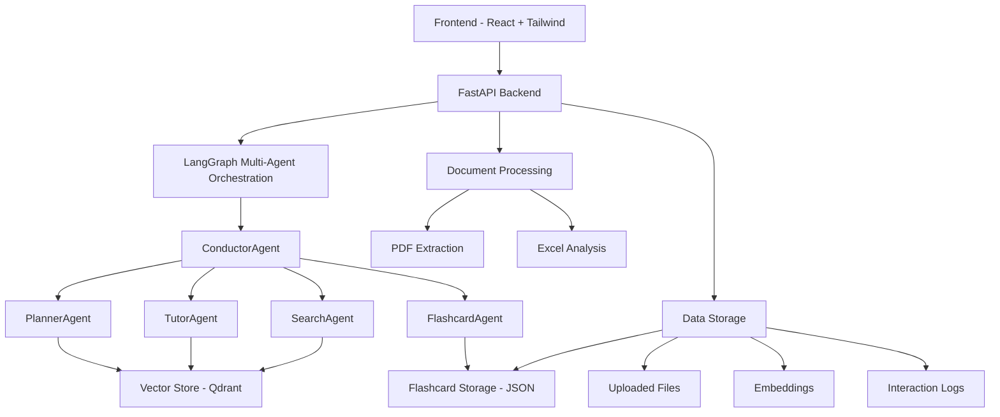

# StudyBuddy AI - System Design Documentation

## Project Overview

StudyBuddy AI is an intelligent study companion that processes documents (PDFs, Excel files) and provides interactive learning through multi-agent AI workflows. The system combines document processing, vector search, study plan generation, adaptive flashcards, and conversational tutoring.

## Architecture Overview



## System Components

### Frontend (React + Tailwind + Framer Motion)

#### Core Components

1. **Dashboard.jsx** - Study progress overview, statistics
2. **UploadForm.jsx** - Document upload interface
3. **ChatBox.jsx** - Conversational interface with AI tutor
4. **PlanEditor.jsx** - Study plan creation and editing
5. **Flashcards.jsx** - Spaced repetition flashcard system
6. **StepsVisualizer.jsx** - Real-time AI processing visualization

#### Key Features

- Dark mode support with system preference detection
- Responsive design with mobile optimization
- Real-time animations using Framer Motion
- Tabbed navigation (Dashboard, Upload, Chat, Plans, Flashcards)
- Progress tracking and visualization

### Backend (FastAPI + LangChain + LangGraph)

#### Multi-Agent Architecture

**ConductorAgent** - Central orchestrator

- Intent analysis and routing
- Workflow coordination
- Response aggregation
- Error handling and fallbacks

**PlannerAgent** - Study plan generation

- Topic analysis from uploaded documents
- Structured learning path creation
- Resource recommendation
- Progress milestone definition

**TutorAgent** - Educational responses

- Context-aware teaching
- Concept explanation with examples
- Source attribution (page numbers, sections)
- Adaptive difficulty based on user progress

**SearchAgent** - External knowledge integration

- Web search for supplementary information
- URL source tracking
- Information synthesis and validation

**FlashcardAgent** - Adaptive learning system

- Automatic flashcard generation from study content
- Spaced repetition algorithm (1, 3, 7 day intervals)
- Difficulty tracking and scheduling
- Progress analytics

#### Data Processing Pipeline

1. **Document Upload & Extraction**

   - PDF: Page-by-page text extraction with metadata
   - Excel: Sheet analysis with data structure preservation
   - File validation and security checks

2. **Text Chunking & Vectorization**

   - Semantic chunking based on content structure
   - Embedding generation using OpenAI models
   - Vector storage in Qdrant with metadata

3. **Context Retrieval**
   - Similarity search across document corpus
   - Relevance scoring and filtering
   - Multi-document context aggregation

#### API Endpoints

```
POST /api/upload          - Document upload and processing
GET  /api/documents       - List processed documents
POST /api/plan           - Generate study plan
GET  /api/plan/{id}      - Retrieve specific plan
POST /api/chat           - Conversational interaction
GET  /api/chat/history   - Chat conversation history
GET  /api/flashcards     - Get due flashcards
POST /api/flashcards/review - Update flashcard schedule
GET  /api/logs           - Interaction logs and analytics
```

## Data Models

### Document Processing

```json
{
  "document_id": "uuid",
  "filename": "document.pdf",
  "file_type": "pdf",
  "upload_timestamp": "2025-01-16T10:30:00Z",
  "processing_status": "completed",
  "page_count": 25,
  "chunks": [
    {
      "chunk_id": "chunk_1",
      "content": "text content",
      "page_number": 1,
      "section_title": "Introduction",
      "embedding": [0.1, 0.2, ...],
      "metadata": {}
    }
  ]
}
```

### Study Plans

```json
{
  "plan_id": "uuid",
  "title": "Machine Learning Fundamentals",
  "overview": "Comprehensive introduction to ML concepts",
  "duration": "6 weeks",
  "difficulty": "Intermediate",
  "created_at": "2025-01-16T10:30:00Z",
  "sections": [
    {
      "id": "section_1",
      "title": "Linear Algebra Basics",
      "description": "Mathematical foundations",
      "learning_objectives": ["Understand vectors", "Matrix operations"],
      "subsections": [
        {
          "title": "Vector Operations",
          "content": "Detailed explanation",
          "activities": ["Practice problems", "Coding exercises"],
          "resources": ["Textbook Chapter 1", "Online tutorials"],
          "estimated_time": "3 hours"
        }
      ]
    }
  ],
  "prerequisites": ["Basic calculus", "Programming experience"],
  "final_assessment": "Build a simple ML model"
}
```

### Flashcards

```json
{
  "flashcard_id": "uuid",
  "question": "What is gradient descent?",
  "answer": "An optimization algorithm that minimizes cost functions",
  "context": "Source material context",
  "difficulty": "medium",
  "created_at": "2025-01-16T10:30:00Z",
  "next_review": "2025-01-19T10:30:00Z",
  "review_count": 3,
  "correct_streak": 2,
  "source_document": "ml_textbook.pdf",
  "source_page": 45
}
```

### Interaction Logs

```json
{
  "log_id": "uuid",
  "timestamp": "2025-01-16T10:30:00Z",
  "session_id": "session_123",
  "user_query": "Explain linear regression",
  "intent": "tutoring",
  "agent_workflow": ["conductor", "tutor", "retriever"],
  "context_sources": [
    {
      "document": "stats_book.pdf",
      "page": 23,
      "relevance_score": 0.92
    }
  ],
  "response": "Linear regression is a statistical method...",
  "processing_time_ms": 1250,
  "user_feedback": "helpful"
}
```

## Technology Stack

### Frontend

- **React 18** - Component-based UI framework
- **Tailwind CSS** - Utility-first styling
- **Framer Motion** - Animation library
- **Heroicons** - Icon system
- **Vite** - Build tool and dev server

### Backend

- **FastAPI** - High-performance Python web framework
- **LangChain** - LLM application framework
- **LangGraph** - Multi-agent workflow orchestration
- **OpenAI API** - Language model and embeddings
- **Qdrant** - Vector database for semantic search
- **PyPDF2** - PDF text extraction
- **Pandas** - Excel file processing
- **Uvicorn** - ASGI server

### Infrastructure

- **Docker** - Containerization
- **Docker Compose** - Multi-service orchestration
- **GitHub Actions** - CI/CD pipeline
- **Nginx** - Reverse proxy (production)

## Key Features & Capabilities

### 1. Document Intelligence

- **Multi-format Support**: PDF and Excel processing
- **Semantic Chunking**: Content-aware text segmentation
- **Metadata Preservation**: Page numbers, sections, structure
- **Vector Search**: Similarity-based content retrieval

### 2. Adaptive Learning

- **Personalized Study Plans**: AI-generated learning paths
- **Spaced Repetition**: Evidence-based flashcard scheduling
- **Progress Tracking**: Learning analytics and insights
- **Difficulty Adaptation**: Content complexity adjustment

### 3. Conversational AI

- **Context-Aware Tutoring**: Educational responses with sources
- **Multi-Agent Coordination**: Specialized AI agents for different tasks
- **Real-time Processing**: Live workflow visualization
- **Source Attribution**: Transparent information provenance

### 4. User Experience

- **Intuitive Interface**: Clean, modern design
- **Dark Mode**: User preference with system detection
- **Responsive Design**: Mobile and desktop optimization
- **Real-time Feedback**: Processing steps and progress indicators

## Limitations & Future Improvements

### Current Limitations

1. **Document Types**: Limited to PDF and Excel files
2. **Language Support**: English-only content processing
3. **User Management**: Single-user system without authentication
4. **Storage**: Local file storage without cloud backup
5. **Collaboration**: No multi-user or sharing features

### Planned Enhancements

1. **Multi-format Support**: Word documents, PowerPoint, images
2. **Multi-language**: International language support
3. **User Authentication**: Secure user accounts and profiles
4. **Cloud Integration**: AWS/Azure storage and deployment
5. **Collaboration Tools**: Shared study plans and group learning
6. **Mobile App**: Native iOS/Android applications
7. **Advanced Analytics**: Learning pattern analysis and recommendations
8. **Export Features**: PDF study guides, flashcard decks
9. **Integration APIs**: Canvas, Moodle, Google Classroom
10. **Offline Mode**: Local processing capabilities

## Security & Privacy

### Data Protection

- Input validation and sanitization
- File type verification and size limits
- Secure file upload handling
- No persistent storage of sensitive data

### API Security

- Rate limiting on all endpoints
- Request validation and error handling
- CORS configuration for cross-origin requests
- Environment variable configuration

### Privacy Considerations

- Local data processing when possible
- Minimal data retention policies
- User control over data deletion
- Transparent data usage policies

## Performance Metrics

### Target Performance

- **Document Processing**: <30s for typical PDFs
- **Query Response**: <3s for chat interactions
- **Plan Generation**: <45s for comprehensive plans
- **Flashcard Creation**: <10s for batch generation
- **UI Responsiveness**: <200ms for user interactions

### Scalability Considerations

- Stateless backend design
- Caching strategies for embeddings
- Async processing for long-running tasks
- Load balancing for multiple users
- Database optimization for vector search

## Deployment Architecture

### Development Environment

```
┌─────────────────┐    ┌─────────────────┐
│   Frontend      │    │    Backend      │
│   localhost:3000│    │  localhost:8000 │
│   (Vite dev)    │    │   (Uvicorn)     │
└─────────────────┘    └─────────────────┘
         │                       │
         └───────────────────────┘
                     │
            ┌─────────────────┐
            │   Qdrant        │
            │  localhost:6333 │
            │  (Docker)       │
            └─────────────────┘
```

### Production Environment

```
┌─────────────────┐
│   Load Balancer │
│     (Nginx)     │
└─────────────────┘
         │
┌─────────────────┐    ┌─────────────────┐
│   Frontend      │    │    Backend      │
│   (Static)      │    │   (FastAPI)     │
└─────────────────┘    └─────────────────┘
                               │
                    ┌─────────────────┐
                    │   Vector DB     │
                    │   (Qdrant)      │
                    └─────────────────┘
```

## Demo Workflow

### 3-Minute Demo Script

1. **Document Upload** (30s)

   - Upload sample ML textbook PDF
   - Show processing pipeline visualization
   - Display document analysis results

2. **Study Plan Generation** (45s)

   - Input topic: "Machine Learning Fundamentals"
   - Demonstrate AI plan creation
   - Show structured learning path with timeline

3. **Interactive Chat** (60s)

   - Ask: "Explain gradient descent with examples"
   - Show real-time agent processing steps
   - Highlight source attribution and context

4. **Flashcard Review** (30s)

   - Display generated flashcards
   - Demonstrate spaced repetition interface
   - Show progress tracking

5. **Dashboard Overview** (15s)
   - Study progress visualization
   - Learning analytics and insights
   - Next steps and recommendations

This comprehensive system design provides a solid foundation for an intelligent, adaptive learning platform that scales from individual use to institutional deployment.
]
}
],
"prerequisites": ["Prereq 1"],
"final_assessment": "Final project description"
}

```

#### 3. **SearchAgent** (`search_agent.py`)

- **Purpose**: Web search using Tavily API for external resources
- **Capabilities**:
  - General topic search
  - Learning resources discovery
  - Practice problems search
  - Information verification
  - Latest updates retrieval

**Features**:

- Tavily API integration
- Structured result formatting
- Educational content filtering
- Source credibility scoring

#### 4. **Enhanced SimpleRAG** (Existing)

- **Purpose**: Document-based question answering
- **Integration**: Used by ConductorAgent for chat intents
- **Features**: Context retrieval, response generation, interaction logging

### API Layer Enhancements

#### New Endpoints

1. **Study Plan Management** (`/api/plan/`)

   - `POST /create`: Generate new study plans
   - `POST /refine`: Refine existing plans
   - `GET /template/{difficulty}`: Get plan templates

2. **Enhanced Chat** (`/api/chat`)
   - Added `use_multi_agent` parameter
   - Returns intent, search results, study plans
   - Backward compatible with simple RAG

### Frontend Enhancements

#### 1. **Enhanced ChatBox** (`ChatBox.jsx`)

- **Multi-Agent Toggle**: Switch between simple RAG and multi-agent mode
- **Intent Display**: Shows detected intent (plan, chat, search, help)
- **Web Search Results**: Formatted display of Tavily search results
- **Study Plan Integration**: Embedded PlanEditor for generated plans
- **Agent Steps Visualization**: Real-time step tracking

#### 2. **PlanEditor Component** (`PlanEditor.jsx`)

- **Interactive Study Plans**: Collapsible tree structure
- **Edit Capabilities**: Inline editing of titles, descriptions
- **Subsection Management**: Add/remove subsections
- **Visual Hierarchy**: Clear section organization
- **Responsive Design**: Works on all screen sizes

#### 3. **Study Plans Tab** (Home.jsx)

- **Plan Generation**: Topic input with AI generation
- **Example Topics**: Quick-start options
- **Real-time Creation**: Loading states and progress
- **Plan Management**: Edit and refine generated plans

#### 4. **Enhanced UI/UX**

- **Beautiful Footer**: "Made with love by Rahul" + GitHub link
- **Improved Styling**: Better gradients, spacing, typography
- **Multi-Agent Indicators**: Visual cues for agent activity
- **Responsive Design**: Mobile-friendly layouts

## Technical Stack (Updated)

### Backend

- **FastAPI**: API framework
- **LangGraph**: Multi-agent orchestration
- **LangChain**: Agent framework and integrations
- **OpenAI**: GPT-4 for planning and chat
- **Tavily**: Web search API
- **Qdrant**: Vector database (existing)
- **Python 3.8+**: Runtime

### Frontend

- **React 18**: UI framework
- **Tailwind CSS**: Styling
- **Heroicons**: Icon library
- **JavaScript ES6+**: Language

### Databases & Storage

- **Qdrant**: Vector embeddings storage
- **Local Storage**: File uploads
- **JSON**: Study plan storage

## Data Flow (Day 3)

### 1. Multi-Agent Chat Flow

```

User Query → ConductorAgent → Intent Analysis
↓
Intent-Based Routing:

- "plan" → PlannerAgent + SearchAgent → Study Plan
- "search" → SearchAgent → Web Results
- "chat" → SimpleRAG → Document Q&A
- "help" → Direct Response
  ↓
  Response Aggregation → Frontend Display

```

### 2. Study Plan Creation Flow

```

Topic Input → PlannerAgent
↓
Context Retrieval (if documents available)
↓
LLM-Based Plan Generation
↓
Structured JSON Output
↓
Frontend PlanEditor Display
↓
User Editing (optional)

```

### 3. Web Search Integration Flow

```

Search Query → SearchAgent → Tavily API
↓
Result Filtering & Formatting
↓
Educational Content Prioritization
↓
Frontend Results Display with Sources

```

## Security & Configuration

### Environment Variables

- `OPENAI_API_KEY`: Required for LLM functionality
- `TAVILY_API_KEY`: Optional for web search
- `QDRANT_HOST/PORT`: Vector database connection
- Other existing configuration

### Error Handling

- Graceful fallbacks when APIs unavailable
- Multi-agent workflow error recovery
- User-friendly error messages
- Comprehensive logging

## Performance Optimizations

- **Async Processing**: Non-blocking agent orchestration
- **Caching**: LLM response caching for common queries
- **Streaming**: Real-time agent step updates
- **Lazy Loading**: Component-based frontend loading

## Future Enhancements (Day 4+)

- **Persistent Study Plans**: Database storage
- **User Accounts**: Personal plan management
- **Progress Tracking**: Learning analytics
- **Advanced Search**: Filtered educational content
- **Collaborative Features**: Shared study plans
- **Mobile App**: React Native implementation
- **Offline Mode**: Local content caching
```
